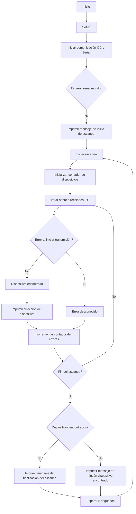

# Practica 5.A. Escáner I2C.
## Objetivos: 
- Comprender el funcionamiento de los buses sistemas de comunicación entre
periféricos; estos elementos pueden ser internos o externos al procesador.
- Crear un escaner para identificar dispositivos conectados a un bus I2C.
## Materiales: 
- ESP32-S3
- Dispositivos I2C
## Procedimiento: 
```cpp
    #include <Arduino.h>
    #include <Wire.h>
    void setup()
    {
    Wire.begin(5,6);
    Serial.begin(115200);
    while (!Serial); // Leonardo: wait for serial monitor
    Serial.println("\nI2C Scanner");
    }
    void loop()
    {
    byte error, address;

    int nDevices;
    Serial.println("Scanning...");
    nDevices = 0;
    for(address = 1; address < 127; address++ )
    {
    // The i2c_scanner uses the return value of
    // the Write.endTransmisstion to see if
    // a device did acknowledge to the address.
    Wire.beginTransmission(address);
    error = Wire.endTransmission();
    if (error == 0)
    {
    Serial.print("I2C device found at address 0x");
    if (address<16)
    Serial.print("0");
    Serial.print(address,HEX);
    Serial.println(" !");
    nDevices++;
    }
    else if (error==4)
    {
    Serial.print("Unknown error at address 0x");
    if (address<16)
    Serial.print("0");
    Serial.println(address,HEX);
    } 
    }
    if (nDevices == 0)
    Serial.println("No I2C devices found\n");
    else
    Serial.println("done\n");
    delay(5000); // wait 5 seconds for next scan
    }
```
**Descripción:**<br>
Es un "I2C Scanner", una herramienta comúnmente utilizada para detectar dispositivos conectados a un bus I2C en un microcontrolador. Comienza con la configuración inicial en la función ``setup()``, dónde se inicia la comunicación I2C y la comunicación serial. Una vez que la comunicación serial está establecida, se imprime un mensaje indicando el inicio del escaneo.<br>
En el bucle principal de ``loop()``, el escáner itera sobre las posibles direcciones I2C (del 1 al 127). Para cada dirección, intenta iniciar una transmisión con el dispositivo en esa dirección. Si la transmisión se completa sin errores, se asume que hay un dispositivo en esa dirección y se imprime un mensaje indicándolo. Se cuenta el número de dispositivos encontrados.<br>
Si hay un error al intentar iniciar la transmisión, se imprime un mensaje indicando el error. Al final del escaneo, se verifica si se encontraron dispositivos. Si no se encontró ninguno, se imprime un mensaje indicando que no se encontraron dispositivos. De lo contrario, se imprime un mensaje indicando que el escaneo ha finalizado. Después de esto, el programa espera 5 segundos antes de realizar el próximo escaneo.<br>
### Diagrama de flujos:

## Salida puerto serie: 
```
    Scanning...
    I2C device found at address 0x27 !
    done
```
## Conclusión: 
Identifica dispositivos conectados a un bus I2C y verificar su dirección. Es útil para diagnosticar problemas de conexión o identificar dispositivos en un sistema I2C.